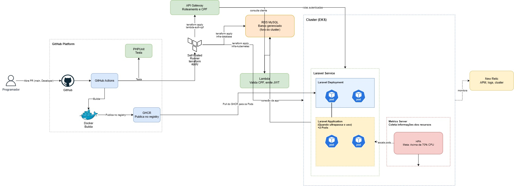

# TechChallenge API
API de autenticação construída com Laravel 13, JWT e MySQL, com ambiente de desenvolvimento via Docker Compose e documentação OpenAPI.

## Descrição da solução e objetivos da fase 2

Esta entrega consolida uma API Laravel com autenticação JWT e duas estratégias de execução:

- Ambiente local com Docker Compose para desenvolvimento e testes rápidos.
- Ambiente Kubernetes (Minikube) provisionado via Terraform para validar deploy, escalabilidade e operação em cluster.

Objetivos principais desta fase:

- Padronizar build e publicação de imagem Docker para o GHCR.
- Automatizar deploy e infraestrutura Kubernetes usando Terraform.
- Garantir rastreabilidade de mudanças por tags de imagem e pipeline CI/CD.
- Manter documentação executável para setup local e execução em cluster.

## Guia rápido desta documentação

- Execução local: veja a seção `Início rápido (do zero)` e `Configuração do ambiente`.
- Deploy em Kubernetes: veja a seção `Ambiente Kubernetes (EKS + Terraform)`.
- Provisionamento com Terraform: veja a seção `Passo a passo` dentro de `Ambiente Kubernetes (EKS + Terraform)`.

## Desenho da arquitetura proposta


## Fase 3 — operação corporativa (AWS, serverless, observabilidade)

A partir desta fase a solução deixa de rodar só em Minikube e passa a ser provisionada em 4
repositórios separados, cada um com seu próprio CI/CD:

- **`tech-challenge-fiap`** (este repositório) — API Laravel, agora implantada em EKS.
- [`infra-kubernetes-fiap`](https://github.com/viniciussalvarenga/infra-kubernetes-fiap) — VPC + cluster EKS.
- [`infra-database-fiap`](https://github.com/viniciussalvarenga/infra-database-fiap) — RDS MySQL gerenciado.
- [`lambda-auth-cpf-fiap`](https://github.com/viniciussalvarenga/lambda-auth-cpf-fiap) — Function Serverless de autenticação por CPF + API Gateway.



Documentação de arquitetura desta fase:

- [Diagrama de sequência](docs/Fase3/diagrama-sequencia.md) — autenticação por CPF e abertura de OS.
- [Justificativa do banco de dados + diagrama ER](docs/Fase3/banco-de-dados.md).
- RFCs: [nuvem](docs/Fase3/rfcs/001-escolha-da-nuvem.md), [banco de dados](docs/Fase3/rfcs/002-escolha-do-banco-de-dados.md), [estratégia de autenticação](docs/Fase3/rfcs/003-estrategia-de-autenticacao.md).
- ADRs: [padrão de comunicação](docs/Fase3/adrs/001-padrao-de-comunicacao.md), [uso de HPA](docs/Fase3/adrs/002-uso-de-hpa.md).

Nesta API, a rota `GET /api/customer/me` é a única protegida pelo JWT de cliente (emitido pela Lambda
`lambda-auth-cpf`, segredo `CUSTOMER_JWT_SECRET` — **diferente** do `JWT_SECRET` usado pela guard
`api`/staff). Ver o RFC de estratégia de autenticação acima para o porquê de serem guards separadas.

## Stack
- PHP 8.4
- Laravel 13
- MySQL 8
- JWT para autenticação
- Docker Compose
- Swagger UI para visualização da documentação


## Pré-requisitos
Antes de iniciar, tenha instalado na máquina:

- Docker
- Docker Compose

## Início rápido (do zero)

Se você quer rodar o projeto com o mínimo de passos, execute:

```bash
make bootstrap
```

Depois, acesse:

- API: `http://localhost:8080`
- Swagger: `http://localhost:8082`

Para parar tudo:

```bash
docker compose down
```

## Serviços disponíveis

Ao subir o ambiente, os serviços ficam disponíveis em:

- API Laravel: `http://localhost:8080`
- Swagger UI: `http://localhost:8082`
- MySQL: `localhost:3308`

## Configuração do ambiente

### 1. Copie o arquivo de ambiente

```bash
cp .env.example .env
```

### 2. Revise as variáveis do banco

O projeto já vem configurado para usar o serviço `db` do Docker Compose. No `.env`, valide ao menos estes campos:

```env
DB_CONNECTION=mysql
DB_HOST=db
DB_PORT=3306
DB_DATABASE=techchallenge
DB_USERNAME=techchallenge
DB_PASSWORD=

JWT_SECRET=
```

Se quiser evitar inconsistência no MySQL, mantenha `DB_PASSWORD` preenchido com o mesmo valor usado no container.

Para gerar o JWT_SECRET precisa ter ao menos 256 bytes. Para facilitar utilize este comando e copie o output:

```
docker compose run --rm app-php php artisan jwt:secret
```

### 3. Suba os containers

```bash
docker compose up -d --build
```

### 4. Instale as dependências do PHP

```bash
docker compose run --rm app-php composer install
```

### 5. Gere a chave da aplicação
```bash
docker compose run --rm app-php php artisan key:generate
```

### 6. Rode as migrations
```bash
docker compose run --rm app-php php artisan migrate
```

## Como executar no dia a dia

Para iniciar o ambiente:

```bash
docker compose up -d
```

## Documentação da API

O contrato da API está no arquivo `openapi.yaml`.

Para visualizar a documentação no navegador, suba o serviço e acesse:

```text
http://localhost:8082
```
## Testes e qualidade de código

O projeto usa um `Makefile` para centralizar os comandos de teste, coverage e análise estática. Certifique-se de ter o `make` instalado na máquina.

### Referência rápida

| Comando | Descrição |
|---|---|
| `make help` | Lista todos os targets disponíveis |
| `make test` | Roda a suíte de testes **sem** gerar relatório de coverage (mais rápido) |
| `make coverage` | Roda os testes e gera `coverage.xml` via PCOV |
| `make scan` | Roda o SonarQube Scanner (requer `SONAR_TOKEN` e SonarQube em pé) |
| `make ci` | `coverage` + `scan` em sequência — ideal para pipelines de CI |
| `make all` | `up` + `coverage` + `scan` |
| `make up` | Sobe os containers de desenvolvimento em background |
| `make down` | Para e remove os containers de desenvolvimento |
| `make lint` | Formata o código com Laravel Pint |
| `make seed-dev` | Popula o banco de dados com informações principais |

### Rodar os testes

```bash
# Execução rápida, sem relatório de cobertura
make test

# Com geração de coverage.xml
make coverage
```

Os testes rodam dentro do container `app-test` definido em `docker-compose.test.yml`, usando um banco MySQL efêmero em tmpfs.

### Análise de cobertura com SonarQube

O SonarQube é configurado no `docker-compose.yml`. Na primeira execução, acesse `http://localhost:9000` para criar um projeto e gerar um token de acesso.

```bash
# Gera coverage e envia para o SonarQube
SONAR_TOKEN=sqa_xxxx make ci
```

O `SONAR_TOKEN` também pode ser exportado no shell para não precisar repeti-lo:

```bash
export SONAR_TOKEN=sqa_xxxx
make ci
```

## Observações

- O container `app-php` publica a aplicação na porta `8080` usando `php artisan serve`.
- O Swagger UI lê diretamente o arquivo `openapi.yaml` do projeto.
- O banco MySQL é exposto localmente na porta `3308`.

## Ambiente Kubernetes (EKS + Terraform)

Até a Fase 2 este ambiente rodava num cluster **Minikube local**. A partir da Fase 3 ele roda num
cluster **EKS real na AWS**, e o banco deixou de ser um `Deployment` MySQL dentro do cluster para
virar um **RDS gerenciado** — ambos provisionados por repositórios próprios, não por este:

- [`infra-kubernetes-fiap`](https://github.com/viniciussalvarenga/infra-kubernetes-fiap) — cria a VPC e o cluster EKS.
- [`infra-database-fiap`](https://github.com/viniciussalvarenga/infra-database-fiap) — cria o RDS MySQL, dentro da mesma VPC.

Este repositório só entra **depois** dos dois acima já aplicados: o `infra/` daqui lê os outputs
deles via `terraform_remote_state` (endpoint do cluster, endereço do RDS etc.) e provisiona só o que
é específico da aplicação — namespace, ConfigMaps, Secrets, Job de migration, Deployment/Service/HPA
do Laravel e do Swagger. Não existem `kubectl apply` soltos nem `local-exec`: cada peça é um resource
do Terraform (`kubernetes_namespace_v1`, `kubernetes_deployment_v1`, `kubernetes_secret_v1` etc.).

### Papel de cada peça

| Peça | Papel |
|---|---|
| **EKS** (`infra-kubernetes-fiap`) | Cluster Kubernetes gerenciado pela AWS, com node group autoescalável. |
| **RDS** (`infra-database-fiap`) | MySQL 8.0 gerenciado, na mesma VPC do EKS. |
| **Terraform** (`infra/`, este repositório) | Namespace, ConfigMaps, Secrets, Job de migration, Deployment/Service/HPA da aplicação e do Swagger — tudo que é específico do Laravel, lendo cluster e banco via `terraform_remote_state`. |
| **GitHub Actions** | `build-ghcr.yml` builda e publica a imagem no GHCR. `deploy-eks.yml` roda `terraform plan` em Pull Requests (path `infra/**`) e `terraform apply` sob demanda (`workflow_dispatch`), contra o EKS real. (`deploy-minikube.yml` ainda existe no repositório, mas é um workflow legado, preso a um runner self-hosted específico — não faz parte do fluxo atual.) |

### Docker Compose vs EKS — quando usar cada um

| | Docker Compose | EKS (homologação/produção) |
|---|---|---|
| Uso principal | Dia a dia, desenvolvimento | Ambiente real, validado por CI/CD |
| Orquestração | `docker-compose.yml` | Resources Terraform (`kubernetes_*`) |
| Banco | Container `db` | RDS gerenciado (`infra-database-fiap`) |
| Acesso externo | Portas mapeadas direto | Network Load Balancer real da AWS (sem tunnel) |
| Escala | Manual | HPA (autoscaling automático, 2–10 réplicas) |

### Pré-requisitos

- `infra-kubernetes-fiap` e `infra-database-fiap` já aplicados (cluster e RDS precisam existir antes deste repositório)
- AWS CLI configurado com credenciais válidas (ver `AWS_ACADEMY.md` do `infra-kubernetes-fiap`, se estiver usando AWS Academy)
- `kubectl`
- Terraform >= 1.6
- Um bucket S3 + tabela DynamoDB para o state remoto (o mesmo usado pelos outros três repositórios)
- Um Personal Access Token do GitHub (classic) com escopo `read:packages`, para puxar a imagem do GHCR

### Passo a passo

**1. Configure o `kubectl` para falar com o EKS**

```bash
make eks-kubeconfig
# equivalente a: aws eks update-kubeconfig --name techchallenge-eks --region us-east-1
```

**2. Configure as variáveis sensíveis**

`app_key`, `db_password`, `jwt_secret` e `customer_jwt_secret` **não precisam ser gerados de novo**
para testar localmente — reaproveite os mesmos valores do seu `.env` (gerados via `make bootstrap`),
exceto `db_password`, que precisa ser **idêntica** à usada no `infra-database-fiap`:

```bash
grep -E '^(APP_KEY|DB_PASSWORD|JWT_SECRET|CUSTOMER_JWT_SECRET)=' .env
```

Crie `infra/terraform.tfvars` com esses valores (está no `.gitignore` — nunca commitar com dados reais):

```hcl
tf_state_bucket     = "O-MESMO-BUCKET-DOS-OUTROS-3-REPOSITORIOS"

app_key             = "base64:COPIE_DO_SEU_.ENV"
db_password         = "IDENTICA_A_DO_INFRA_DATABASE"
jwt_secret          = "COPIE_DO_SEU_.ENV"
customer_jwt_secret = "IDENTICA_A_DO_LAMBDA_AUTH_CPF"

ghcr_username = "SEU_USUARIO_GITHUB"
ghcr_token    = "SEU_TOKEN_COM_read:packages"

# Opcionais — já têm default em variables.tf, só defina se quiser sobrescrever:
# ghcr_email           = "SEU_EMAIL"
# mail_username        = "SEU_EMAIL_SMTP"
# mail_password        = "SUA_SENHA_DE_APP"
# newrelic_license_key = "SUA_LICENSE_KEY"
```

**3. Aplique com Terraform**

Via `Makefile` (recomendado — valida `TF_STATE_BUCKET`/`TF_LOCK_TABLE` e se `terraform.tfvars` existe):

```bash
TF_STATE_BUCKET=seu-bucket TF_LOCK_TABLE=sua-tabela make infra-init
make infra-apply
# ou os dois passos de uma vez: TF_STATE_BUCKET=... TF_LOCK_TABLE=... make k8s-up
```

Ou manualmente:

```bash
cd infra
terraform init \
  -backend-config="bucket=seu-bucket" \
  -backend-config="key=app/terraform.tfstate" \
  -backend-config="region=us-east-1" \
  -backend-config="dynamodb_table=sua-tabela"
terraform apply
cd ..
```

Isso cria o namespace, ConfigMaps, Secrets, roda o Job de migration (contra o RDS) e sobe a aplicação
e o Swagger — nessa ordem, controlada pelas dependências entre os resources.

### Acessando a documentação (Swagger)

Os Services da app e do Swagger são `LoadBalancer` de verdade na AWS — sem tunnel, mas o DNS do NLB
pode levar alguns minutos para propagar depois do primeiro `apply`.

```bash
make k8s-urls
```

Isso imprime:

```bash
App:     http://xxxxx.elb.us-east-1.amazonaws.com:8080
Swagger: http://xxxxx.elb.us-east-1.amazonaws.com:8082
```

Abra a URL do **Swagger** no navegador para acessar a documentação interativa
da API (`openapi.yaml` da raiz do projeto).

**Para desligar a stack da aplicação (não afeta o EKS nem o RDS em si):**

Via Makefile: `make k8s-down`

Ou manualmente:
```bash
cd infra && terraform destroy && cd ..
```

### Atualizando a aplicação (nova imagem)

Como a tag da imagem (`image_tag`) faz parte do nome do Deployment e do Job de migration, basta rodar `terraform apply` de novo com uma tag nova para que o Terraform detecte a mudança, recrie o Job de migration e faça o rollout do Deployment automaticamente — sem precisar de `kubectl rollout restart` manual:

```bash
make infra-apply IMAGE_TAG=sha-abc1234
```

### Deploy automático (CI/CD) — homologação e produção

O workflow `.github/workflows/deploy-eks.yml` roda `terraform apply` automaticamente, sem passo
manual, disparado pelo `workflow_run` do `build-ghcr.yml` (ou seja: só depois que a imagem daquele
commit já foi publicada no GHCR com a tag `sha-<7 chars>`):

| Branch | Ambiente | Namespace | State key (S3) |
|---|---|---|---|
| `main` | Produção | `postech` | `app/production/terraform.tfstate` |
| `homologacao` | Homologação | `postech-homolog` | `app/homolog/terraform.tfstate` |

As duas branches usam o **mesmo cluster EKS e o mesmo RDS** (`infra-kubernetes-fiap` e
`infra-database-fiap` não são duplicados) — decisão tomada para não estourar o crédito limitado do
AWS Academy. O isolamento entre ambientes vem só do namespace do Kubernetes e da state key do
Terraform, que o workflow calcula sozinho a partir da branch que disparou o build (step "Resolve
ambiente" em `deploy-eks.yml`).

Um Pull Request pra `main` que mexe em `infra/**` continua rodando só `terraform plan` (sem apply) —
o merge é que dispara o deploy de verdade. `workflow_dispatch` continua disponível como fallback
manual, com um input `environment` (`production`/`homolog`) pra escolher o alvo.

Como no AWS Academy as credenciais (`AWS_ACCESS_KEY_ID`/`AWS_SECRET_ACCESS_KEY`/`AWS_SESSION_TOKEN`)
expiram em poucas horas, isso ainda exige atualizar esses três secrets a cada sessão nova do Lab —
mas como um secret de nível **organization** (`VinnyTechDevelopment`) é compartilhado pelos 4
repositórios, essa atualização passa a ser feita em um lugar só.

### Referência rápida (make)

| Comando | Descrição |
|---|---|
| `make eks-kubeconfig` | Configura o `kubectl` para falar com o cluster EKS |
| `make infra-init` | `terraform init` em `infra/` com backend S3 (requer `TF_STATE_BUCKET`/`TF_LOCK_TABLE`; valida se `terraform.tfvars` existe) |
| `make infra-plan` | `terraform plan` (aceita `IMAGE_TAG=<tag>`) |
| `make infra-apply` | `terraform apply` (aceita `IMAGE_TAG=<tag>`) |
| `make infra-destroy` | Remove a stack da aplicação provisionada por este repositório (não afeta o EKS nem o RDS) |
| `make k8s-up` | `infra-init` + `infra-apply` em sequência |
| `make k8s-down` | Alias de `infra-destroy` |
| `make k8s-status` | Mostra pods e services do namespace |
| `make k8s-urls` | Exibe as URLs de acesso (Network Load Balancer real da AWS) |

## Observabilidade (New Relic)

O código e a infraestrutura já estão prontos pro New Relic, mas **ainda não existe conta criada** —
por isso tudo fica desligado por padrão (agente instalado mas inerte na imagem Docker, dashboards com
`newrelic_enabled = false` em `infra/variables.tf`). O que já está pronto:

- **Agente PHP**: instalado no `Dockerfile` (pacote `newrelic-php5`). Em runtime,
  `docker/entrypoint.sh` só escreve a license key no `newrelic.ini` se a env var
  `NEWRELIC_LICENSE_KEY` estiver setada — sem ela, o agente não reporta nada e a aplicação sobe
  normalmente.
- **Dashboards como código**: `infra/newrelic.tf` declara dois `newrelic_one_dashboard` (Ordens de
  Serviço e Infraestrutura) cobrindo os itens pedidos na Fase 3 — volume diário de OS, tempo médio
  por status, erros de integração, latência de API, CPU/memória do Kubernetes e uptime — atrás de
  `count = var.newrelic_enabled ? 1 : 0`.

### Passo a passo para ligar de verdade

1. Crie uma conta free em [newrelic.com](https://newrelic.com/signup).
2. Gere uma **License Key** (Account settings → API keys) — é o que o agente PHP usa para enviar
   dados.
3. Gere uma **User API Key** (mesmo local) — é o que o provider Terraform `newrelic/newrelic` usa
   para criar os dashboards via API.
4. Anote o **Account ID** (aparece no mesmo painel de API keys).
5. Configure os secrets no nível da **organization** do GitHub (`VinnyTechDevelopment` → Settings →
   Secrets and variables → Actions), compartilhados pelos 4 repositórios:
   - `NEWRELIC_LICENSE_KEY` (usada pelo agente PHP, via Secret do K8s)
   - `NEW_RELIC_API_KEY` (User API Key, usada só pelo provider Terraform)
   - `NEW_RELIC_ACCOUNT_ID`
6. Em `infra/deploy-eks.yml`, descomente as três linhas marcadas com `NEW_RELIC_*` /
   `TF_VAR_newrelic_enabled` no `env:` do job.
7. Rode `terraform apply` (via push em `main`/`homologacao`, ou `make infra-apply` local) — os
   dashboards aparecem em New Relic One, e o agente PHP passa a reportar transações, erros e (via a
   integração de Kubernetes do repositório `infra-kubernetes-fiap`) métricas de CPU/memória dos
   pods.

Depois que o agente estiver reportando dados de verdade, revise as queries NRQL em
`infra/newrelic.tf` — foram escritas sem uma conta real pra validar contra, então nomes de evento ou
atributo podem precisar de ajuste fino.
