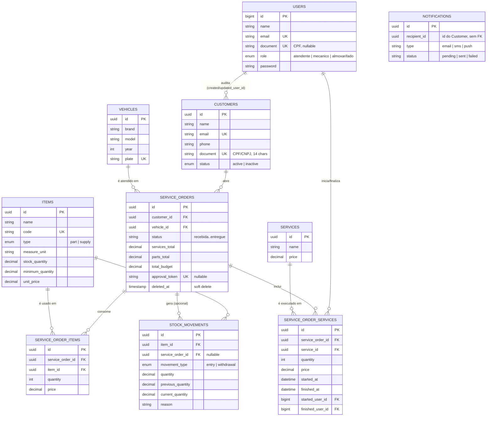

# Justificativa da escolha do banco e modelo relacional

Ver também o [RFC 002 — Escolha do banco de dados](./rfcs/002-escolha-do-banco-de-dados.md) para a
comparação entre alternativas (MySQL vs. PostgreSQL vs. DynamoDB).

## Diagrama ER

Cobre as tabelas de domínio (Vehicle, Customer, Service, Item/Estoque, ServiceOrder, Notification).
Tabelas de infraestrutura do próprio Laravel (`cache`, `jobs`, `sessions`, `personal_access_tokens`,
`password_reset_tokens`) foram omitidas por não fazerem parte do domínio de negócio. As colunas de
auditoria `created_user_id`/`updated_user_id` (presentes em quase toda tabela, sempre referenciando
`users`) também foram omitidas do diagrama para não poluir a leitura — estão listadas em texto abaixo
de cada entidade.

## Por que UUID como chave primária nas tabelas de domínio

Todas as entidades de domínio (`customers`, `vehicles`, `services`, `items`, `service_orders`, etc.)
usam `uuid` como chave primária, gerado na **Entity** (`Str::uuid()->toString()`), nunca no banco —
regra explícita do projeto (ver `CLAUDE.md`). Isso existe porque:

- O id precisa existir **antes** do INSERT (a camada de Aplicação já usa o id da Entity para montar
  respostas, eventos e relações entre agregados, ex.: `ServiceOrder` referenciando `Customer`/`Vehicle`
  por id, sem round-trip ao banco para descobrir o id gerado).
- IDs não sequenciais evitam enumeração (ex.: `GET /vehicle/1`, `/vehicle/2`, ...) e não vazam volume
  de negócio (quantos clientes/veículos existem) pela URL.
- `users` (a única tabela de staff/autenticação) continua com `bigint auto_increment` — é a exceção
  deliberada: o pacote `php-open-source-saver/jwt-auth` e o `Illuminate\Foundation\Auth\User` do
  Laravel assumem chave numérica por convenção, e não há benefício de segurança em esconder o id de
  um usuário interno da própria oficina.

## Colunas de auditoria (`created_user_id`/`updated_user_id`)

Praticamente toda tabela de domínio guarda quem criou/alterou o registro, como `foreignId` para
`users`, **not null**. Isso é o que hoje impede, por exemplo, rodar o `DevDataSeeder` sem antes
autenticar um usuário (`Auth::guard('api')->login($user)`) — é intencional: nenhum registro de
domínio deveria existir sem um responsável identificável, dado que a oficina é auditável (várias
unidades, vários atendentes).

## Enums vs. tabelas de lookup

`status` (em `customers`, `items.type`, `stock_movements.movement_type`, `service_orders.status`) e
`role` (em `users`) são `enum` nativo do MySQL, não tabelas de lookup separadas. Trade-off consciente
para um domínio pequeno e estável (a lista de status de uma OS, por exemplo, é uma regra de negócio
do próprio código — `ServiceOrder::assertStatus()` — não algo que um usuário final cadastra em tempo
de execução). O custo é que adicionar um novo valor exige migration + deploy, não um INSERT — aceitável
neste estágio do projeto.

## `service_order_items` / `service_order_services` como tabelas associativas com atributos

Não são muitos-para-muitos "puros" (`service_order_id` + `item_id` como PK composta) porque cada
associação carrega dados próprios do momento da venda: `quantity` e `price` são um **snapshot** do
preço no momento em que o item/serviço entrou na OS — se o preço do catálogo mudar depois, a OS já
fechada não deve ser afetada. Por isso cada linha tem seu próprio `uuid` como PK, e não uma chave
composta.
