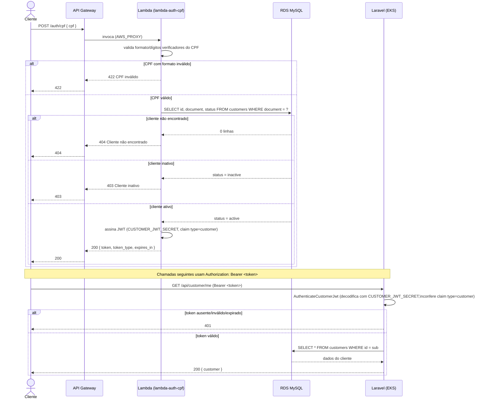
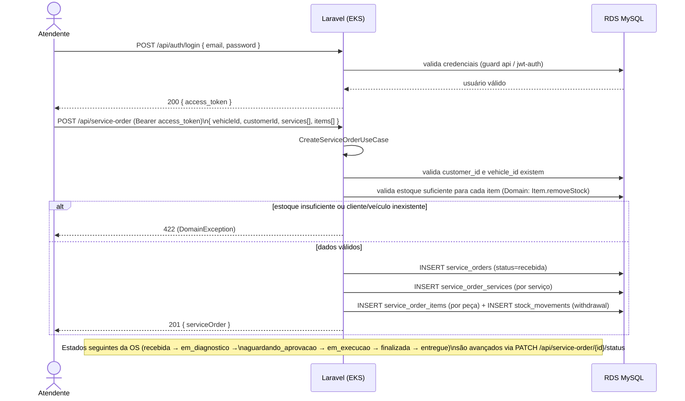

# Diagrama de Sequência — Fase 3

Ver também o [Diagrama de Componentes](./workflow.jpg) para a visão geral de infraestrutura.

## 1. Autenticação do cliente via CPF

O cliente nunca fala diretamente com o Laravel para se autenticar — quem valida o CPF, confere o
status do cliente e emite o token é a Function Serverless (`lambda-auth-cpf`), atrás do API Gateway.
O Laravel só entra depois, para validar esse token nas rotas que aceitam cliente (ex.: `GET /customer/me`).

Pontos de decisão relevantes (ver [RFC 003](./rfcs/003-estrategia-de-autenticacao.md)):

- O JWT do cliente usa um segredo (`CUSTOMER_JWT_SECRET`) e uma guard **diferentes** do JWT de
  staff (`JWT_SECRET`/`php-open-source-saver/jwt-auth`) — são identidades e propósitos distintos
  (cliente por CPF vs. usuário de staff com senha).
- A Lambda consulta o RDS diretamente (mesma VPC), não através da API Laravel — evita acoplar a
  autenticação à disponibilidade do cluster EKS.

## 2. Abertura de uma Ordem de Serviço (fluxo de staff)

Este fluxo já existe na aplicação (não é novidade da Fase 3), mas documentamos aqui porque o
requisito pede explicitamente o diagrama de sequência desse caso.

